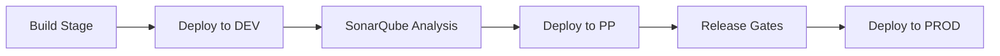

# Skillup-Capstone-Project-Prince

## Overview
This project implements an **Azure CI/CD Multistage Pipeline** to build and deploy a .NET application across **DEV**, **PP**, and **PROD** environments using **Azure DevOps**.  
The application is based on the [Microsoft eShopOnWeb](https://github.com/MicrosoftLearning/eShopOnWeb.git) sample, extended with Azure infrastructure provisioning and automated deployments.

---

## Project Architecture

- **Source Code**: Microsoft eShopOnWeb (.NET 7 application)
- **Infrastructure**: Azure Kubernetes Service (AKS) with three environments (DEV, PP, PROD) provisioned using **Bicep** scripts.
- **CI/CD Pipeline**: Azure DevOps multistage pipeline for build, test, and deploy.
- **Quality Gate**: SonarQube integration for code quality checks.
- **Release Control**: Release gates for PROD deployment approval.
- **Scalability**: AKS cluster autoscaling configured to respond to load changes.

---

## Steps Performed

1. **Created Azure DevOps Project** – Project named `Skillup-Capstone-Project-Prince`.
2. **Cloned Source Code** – Pulled `.NET` code from [GitHub eShopOnWeb repo](https://github.com/MicrosoftLearning/eShopOnWeb.git).
3. **Provisioned Azure Infrastructure** – Used **Bicep scripts** to create AKS clusters for DEV, PP, and PROD.
4. **Created Azure Boards** – One ticket per environment, assigned to self.
5. **Built and Deployed to DEV** – Configured CI/CD to deploy to DEV AKS.
6. **SonarQube Integration** – Static code analysis before deploying to PP.
7. **Release Gates for PROD** – Approval checks before PROD deployment.
8. **AKS Autoscaling** – Configured Horizontal Pod Autoscaler.

---

## Pipeline Structure

---

## Tools & Technologies

- Azure DevOps (Repos, Pipelines, Boards, Artifacts)
- Azure Kubernetes Service (AKS)
- Bicep (Infrastructure as Code)
- Docker (Containerization)
- SonarQube (Code Quality Analysis)
- Horizontal Pod Autoscaler (HPA)

---

## Project Proof & Screenshots

Below are screenshots as evidence of project completion:

1. **Azure DevOps Project Created**  
   

2. **Pipeline Execution (DEV → PP → PROD)**  
   

3. **SonarQube Code Analysis Report**  
   

4. **Azure Boards Tickets**  
   

5. **AKS Autoscaling in Action**  
   

---

## Learnings

- Gained experience in **end-to-end Azure DevOps pipelines**.
- Learned **Bicep scripting** for AKS provisioning.
- Implemented **SonarQube quality gates** in pipelines.
- Understood **autoscaling in AKS** for better performance.

---

## Repository

Source Code: [Microsoft eShopOnWeb](https://github.com/MicrosoftLearning/eShopOnWeb.git)
