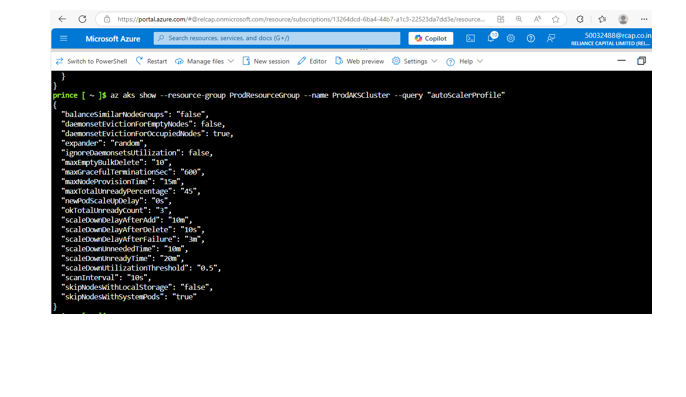

# Skillup-Capstone-Project-Prince

## Overview
This project implements an **Azure CI/CD Multistage Pipeline** to build and deploy a .NET application across **DEV**, **PP**, and **PROD** environments using **Azure DevOps**.  
The application is based on the [Microsoft eShopOnWeb](https://github.com/MicrosoftLearning/eShopOnWeb.git) sample, extended with Azure infrastructure provisioning and automated deployments.

---

## Project Architecture

- **Source Code**: Microsoft eShopOnWeb (.NET 7 application)
- **Infrastructure**: Azure Kubernetes Service (AKS) with three environments (DEV, PP, PROD) provisioned using **Bicep** scripts.
- **CI/CD Pipeline**: Azure DevOps multistage pipeline for build, test, and deploy.
- **Quality Gate**: SonarQube integration for code quality checks.
- **Release Control**: Release gates for PROD deployment approval.
- **Scalability**: AKS cluster autoscaling configured to respond to load changes.

---

## Steps Performed

1. **Created Azure DevOps Project** – Project named `Skillup-Capstone-Project-Prince`.
2. **Cloned Source Code** – Pulled `.NET` code from [GitHub eShopOnWeb repo](https://github.com/MicrosoftLearning/eShopOnWeb.git).
3. **Provisioned Azure Infrastructure** – Used **Bicep scripts** to create AKS clusters for DEV, PP, and PROD.
4. **Created Azure Boards** – One ticket per environment, assigned to self.
5. **Built and Deployed to DEV** – Configured CI/CD to deploy to DEV AKS.
6. **SonarQube Integration** – Static code analysis before deploying to PP.
7. **Release Gates for PROD** – Approval checks before PROD deployment.
8. **AKS Autoscaling** – Configured Horizontal Pod Autoscaler.

---

## Pipeline Structure

---

## Tools & Technologies

- Azure DevOps (Repos, Pipelines, Boards, Artifacts)
- Azure Kubernetes Service (AKS)
- Bicep (Infrastructure as Code)
- Docker (Containerization)
- SonarQube (Code Quality Analysis)
- Horizontal Pod Autoscaler (HPA)

---

## Project Proof & Screenshots

Below are screenshots as evidence of project completion:

1. **Azure DevOps Project Created**
    
   

2. **Pipeline Execution (DEV → PP → PROD)**

   trigger:
  branches:
    include:
    - main
pool:
  vmImage: 'ubuntu-latest'
variables:
- name: buildConfiguration
  value: 'Release'
- name: azureSubscription
  value: 'Free Trail'
- name: resourceGroupName
  value: 'ProdResourceGroup'
- name: aksClusterName
  value: 'ProdAKSCluster'
- name: containerRegistry
  value: 'akscuster123.azurecr.io'
- name: imageName
  value: 'dotnet-app'
stages:
- stage: BuildAndPush
  displayName: Build and Push Docker Image
  jobs:
  - job: BuildAndPushImage
    displayName: Build .NET Application and Push Docker Image
    steps:
    - task: UseDotNet@2
      displayName: Install .NET SDK
      inputs:
        packageType: sdk
        version: '8.x'
        installationPath: $(Agent.ToolsDirectory)/dotnet
    - task: CmdLine@2
      displayName: 'Build .NET Application'
      inputs:
        script: |
          echo "Building and Publishing .NET Application..."
          dotnet restore src/PublicApi/PublicApi.csproj
          dotnet build src/PublicApi/PublicApi.csproj --configuration $(buildConfiguration)
          dotnet publish src/PublicApi/PublicApi.csproj --configuration $(buildConfiguration) -o $(Build.ArtifactStagingDirectory)
    - task: PublishPipelineArtifact@1
      inputs:
        targetPath: '$(System.DefaultWorkingDirectory)/k8s'
        artifact: 'k8sManifests'
      displayName: Publish Kubernetes Manifests
    - task: Docker@2
      displayName: Build and Push Docker Image
      inputs:
        containerRegistry: $(containerRegistry)
        repository: $(imageName)
        command: 'buildAndPush'
        Dockerfile: '$(System.DefaultWorkingDirectory)/Dockerfile'
        tags: |
          $(Build.BuildId)
- stage: PreDeployApproval
  displayName: Pre-Deployment Approval
  dependsOn:
  - BuildAndPush
  jobs:
  - job: ManualApproval
    displayName: Manual Approval
    pool:
      name: server
    steps:
    - task: ManualValidation@0
      displayName: 'Wait for approval before deploying to production'
      inputs:
        instructions: 'Please review and approve the deployment to production.'
        onTimeout: 'reject'
- stage: Deploy
  displayName: Deploy to AKS
  dependsOn:
  - PreDeployApproval
  jobs:
  - deployment: DeployToAKS
    displayName: Deploy Application to AKS
    environment:
      name: Prod
    strategy:
      runOnce:
        deploy:
          steps:
          - task: DownloadPipelineArtifact@2
            inputs:
              artifact: 'k8sManifests'
              path: '$(System.DefaultWorkingDirectory)/k8s'
            displayName: Download Kubernetes Manifests
          - task: CmdLine@2
            displayName: Validate Kubernetes Manifests
            inputs:
              script: |
                echo "Validating Kubernetes manifests..."
                if [ ! -f "$(System.DefaultWorkingDirectory)/k8s/deployment.yml" ] || [ ! -f "$(System.DefaultWorkingDirectory)/k8s/service.yml" ]; then
                  echo "Error: Required Kubernetes manifest files not found!"
                  exit 1
                fi
                echo "Kubernetes manifests are present."
          - task: AzureCLI@2
            displayName: Deploy to AKS using Azure CLI
            inputs:
              azureSubscription: $(azureSubscription)
              scriptType: bash
              scriptLocation: inlineScript
              inlineScript: |
                echo "Authenticating with AKS..."
                az aks get-credentials --resource-group $(resourceGroupName) --name $(aksClusterName) --overwrite-existing
                echo "Deploying Kubernetes manifests..."
                sed -i "s|IMAGE_PLACEHOLDER|$(containerRegistry)/$(imageName):$(Build.BuildId)|g" $(System.DefaultWorkingDirectory)/k8s/deployment.yml
                kubectl apply -f $(System.DefaultWorkingDirectory)/k8s/deployment.yml
                kubectl apply -f $(System.DefaultWorkingDirectory)/k8s/service.yml
   
   

   

3. **Azure Boards Tickets**  

  

4. **Configure the release gates before deploying to PROD environment.**
    

4. **AKS Autoscaling in Action**  

   

   

   

   

---

## Learnings

- Gained experience in **end-to-end Azure DevOps pipelines**.
- Learned **Bicep scripting** for AKS provisioning.
- Implemented **SonarQube quality gates** in pipelines.
- Understood **autoscaling in AKS** for better performance.

---

## Repository

Source Code: [Microsoft eShopOnWeb](https://github.com/MicrosoftLearning/eShopOnWeb.git)
